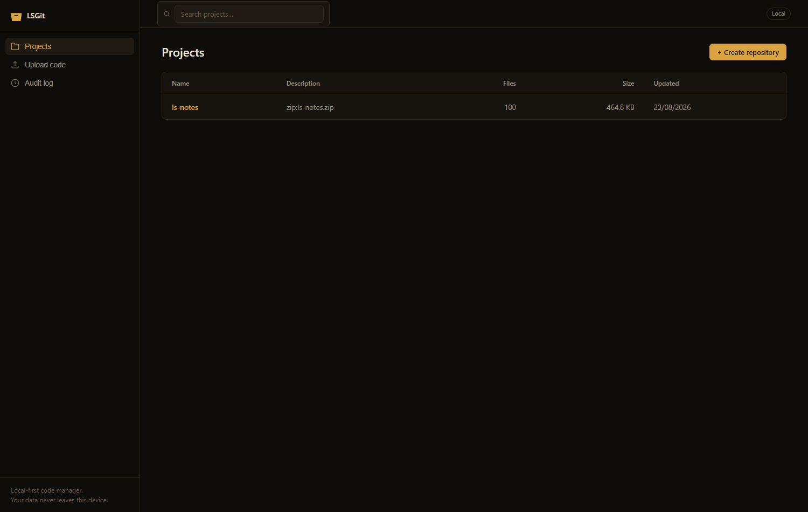
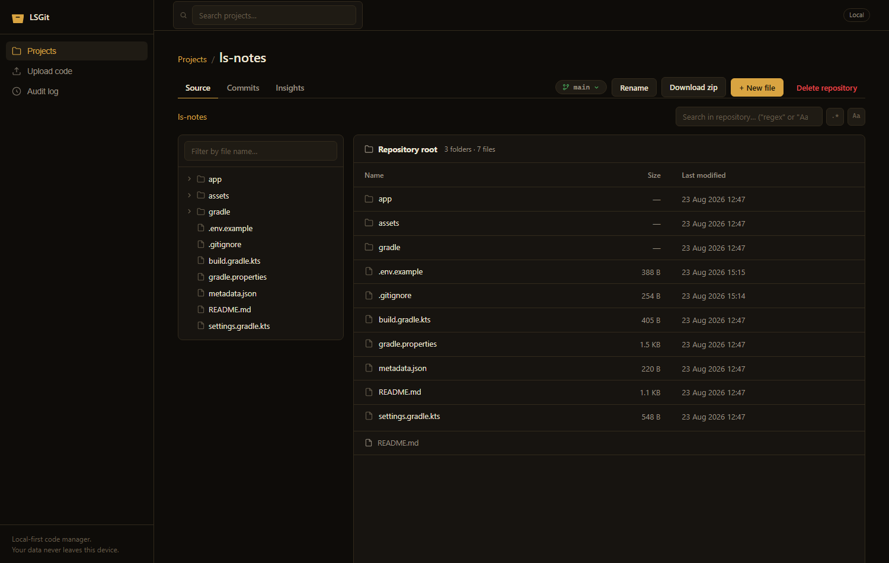
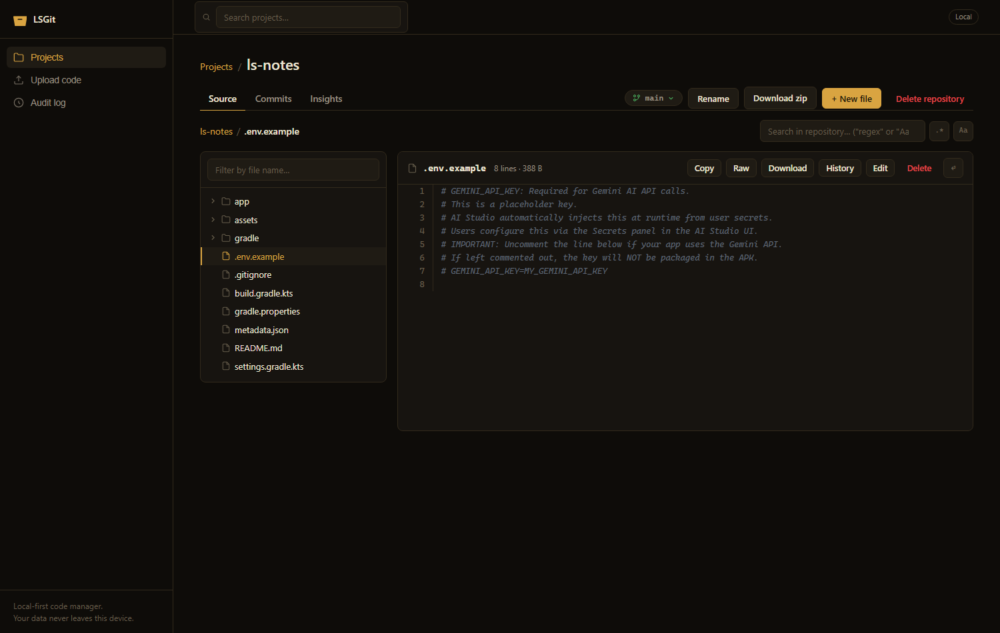
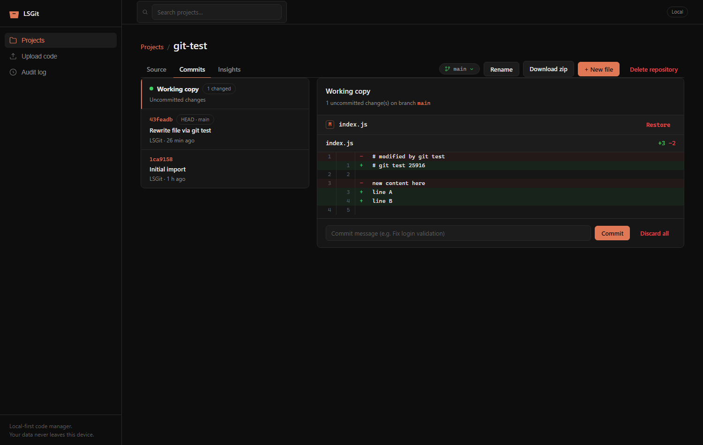
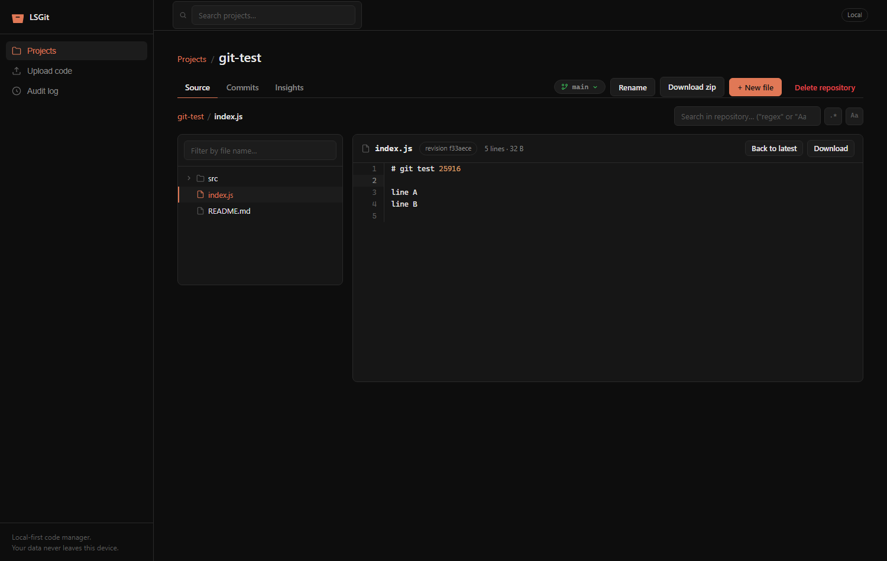
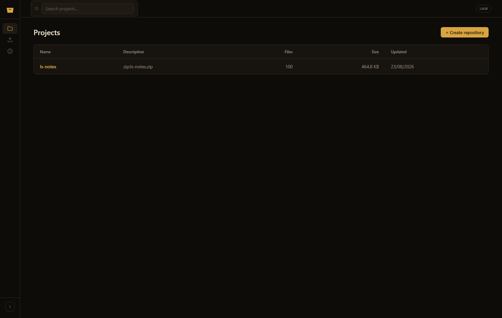

<div align="center">


# LSGit — Local Code Manager

**A local-first, offline-capable source code manager with real git versioning,
a Bitbucket-style browser, and a quiet golden dark UI.**

No accounts. No cloud. No telemetry. Your code never leaves your machine.

`Node.js` · `Express` · `isomorphic-git` · `Vanilla JS` · `MIT`

</div>

---

## Table of contents

- [Why LSGit](#why-lsgit)
- [Features](#features)
- [Screenshots](#screenshots)
- [Quick start](#quick-start)
- [Configuration](#configuration)
- [Using the app](#using-the-app)
  - [Create a repository](#create-a-repository)
  - [Browse source](#browse-source)
  - [Code viewer](#code-viewer)
  - [Git versioning](#git-versioning)
  - [Search & insights](#search--insights)
  - [Audit log](#audit-log)
- [How it works](#how-it-works)
- [Project structure](#project-structure)
- [Documentation](#documentation)
- [Security model](#security-model)
- [Browser support](#browser-support)
- [Troubleshooting](#troubleshooting)
- [FAQ](#faq)
- [Contributing](#contributing)
- [License](#license)

---

## Why LSGit

Most code-hosting tools want you in the cloud. LSGit is the opposite: a
**single Node process** that turns any folder of source code into a browsable,
searchable, **git-versioned** repository — running entirely on `localhost`.

Built for:

- **Individual developers** who want Bitbucket/GitHub-style browsing for local
  projects, prototypes, and downloaded zips — without creating repos online.
- **Air-gapped / offline machines** — after `npm install`, zero network access is
  required. Ever.
- **Privacy-conscious users** — no accounts, no telemetry, no analytics, no
  phoning home. The audit log proves what the app does, locally.

---

## Features

### Repositories
- **Upload as zip** (up to 200 MB, configurable) — GitHub-style archives are
  auto-flattened; executables inside are skipped, never blocking the upload
- **Upload loose files** — drag & drop or picker, folder structure preserved
- **Add files to existing repos** via drag & drop
- Rename, edit description, delete, **download as zip** (git metadata excluded)

### Source browser (Bitbucket-style)
- Clickable **breadcrumb path** navigation
- Collapsible **file tree sidebar** with filter-as-you-type
- Directory tables with **size** and **last-modified** columns
- **README.md rendered** below every folder listing (sanitized markdown)
- Collapsible **golden dark** sidebar (persisted)

### Code viewer
- Syntax highlighting for **30+ languages** (highlight.js, dark theme)
- Sticky **line-number gutter** — click a line to highlight it
- **Soft-wrap toggle**, **Copy**, **Raw**, **Download**, **Edit**, **Delete**
- Markdown files with **Rendered ⇄ Source** toggle
- Binary files detected and offered as download

### Git versioning — real git, fully local
- Every repo gets a **standard `.git`** (isomorphic-git — no git CLI needed)
- **Working copy view**: changed files with A/M/D badges + unified diffs
- **Commit** with messages; auto-commits on upload
- **Commit history** with per-commit changed files and diffs
- **Branches**: create, switch, delete (conflict-safe checkout)
- **File history**: view any file at any revision
- **Restore file / Discard all** for safe rollbacks
- CLI-compatible — `git log` works on the data folder

### Search & insights
- Repository-wide **text search** with regex and case-sensitive modes
- **Insights** dashboard: file count, lines of code, language breakdown bar

### Platform
- **100% offline** after install — all assets vendored, no CDN, no fonts, no APIs
- All user preferences in **IndexedDB** (sidebar state, expanded folders,
  last-visited file per repo, wrap/markdown prefs) — restored automatically
- **Audit log** of every state-changing action
- Configurable via `.env` / environment variables
- Zero build step, zero dev dependencies

---

## Screenshots

| Projects | Source browser |
|---|---|
|  |  |

| Code viewer | Working copy diff |
|---|---|
|  |  |

| File history | Collapsed sidebar |
|---|---|
|  |  |

---

## Quick start

**Requirements:** Node.js ≥ 18. No git CLI, no database, no build tools.

```bash
# 1. Clone or download
git clone https://github.com/girishlade111/owngit.git
cd owngit

# 2. Install dependencies (one-time; afterwards the app is fully offline)
npm install

# 3. Run
npm start          # → http://localhost:3000
```

Development mode with auto-restart:

```bash
npm run dev        # node --watch server.js
```

Optional configuration via `.env` (copy `.env.example`):

```ini
PORT=3000
HOST=127.0.0.1
MAX_UPLOAD_MB=200
MAX_PREVIEW_MB=2
# DATA_DIR=D:\LSGitData
```

First run creates `data/` with `repos/`, `metadata.json` and `audit.log`.
That folder is your entire dataset — back it up and you've backed up everything.

---

## Configuration

All settings are environment variables (optionally via a `.env` file in the
project root). Real environment variables take precedence over `.env`, which
takes precedence over defaults.

| Variable | Default | Description |
|----------|---------|-------------|
| `PORT` | `3000` | HTTP port |
| `HOST` | `0.0.0.0` | Bind interface (`127.0.0.1` = this machine only) |
| `MAX_UPLOAD_MB` | `200` | Max archive/upload size |
| `MAX_PREVIEW_MB` | `2` | Max file size openable in the viewer |
| `DATA_DIR` | `./data` | Where repos, metadata and audit log live |

Full reference, syntax rules and recipes: **[docs/CONFIGURATION.md](docs/CONFIGURATION.md)**

---

## Using the app

### Create a repository

1. Click **Upload code** in the sidebar (or **+ Create repository**).
2. Enter a name and description.
3. Drop a `.zip` (e.g. a GitHub *Download ZIP*) or choose loose files.
4. **Create repository** — files are extracted, a git repo is initialized and an
   initial snapshot is committed automatically.

> Blocked file types (`.exe`, `.dll`, `.bat`, `.sh`, …) inside archives are
> **skipped individually** — one script file never blocks a whole upload.

### Browse source

- Click any repo in **Projects**.
- Navigate with the **breadcrumbs** (`repo / lib / class`) or the **file tree** on
  the left (folders expand; the filter box finds any file instantly).
- Directories show name/size/last-modified tables; a folder's `README.md` renders
  underneath automatically.

### Code viewer

Click any file: syntax-highlighted content with a line-number gutter (click a
line to mark it), plus **Copy / Raw / Download / History / Edit / Delete** and a
soft-wrap toggle. Markdown files get a **Rendered ⇄ Source** switch.

### Git versioning

Open the **Commits** tab:

- **Working copy** (pinned at top when dirty) lists every added/modified/deleted
  file with a click-to-expand unified diff. Write a message → **Commit**.
  *Restore* reverts a single file; *Discard all* resets everything (confirmed).
- **Commit list** — every commit with hash, HEAD badge, author and time; click
  one to see its changed files and diffs.
- **Branch dropdown** (tab bar) — create, switch, delete branches.
- **History** button in the file header → every revision of that file, viewable
  read-only.

Under the hood this is a **standard git repository** — see
[docs/GIT_VERSIONING.md](docs/GIT_VERSIONING.md).

### Search & insights

- Press Enter in the repo search box (top right of the Source tab) — supports
  `"quoted regex"` and a case-sensitive toggle. Up to 200 hits, click to jump.
- The **Insights** tab shows totals and a per-language breakdown by lines.

### Audit log

Every mutating action (create, upload, edit, delete, commit, branch, …) is
recorded with timestamp and actor IP in `data/audit.log`; the last 100 events are
viewable in the **Audit log** view.

---

## How it works

```
Browser (vanilla JS SPA, no build)
   │  fetch / JSON  ·  multipart uploads  ·  IndexedDB for preferences
   ▼
Express server (server.js)
   │
   ├── lib/storage.js   → filesystem: walk, zip in/out, path safety, audit
   ├── lib/git.js       → isomorphic-git: init/commit/log/branch/diff/restore
   └── lib/config.js    → .env + environment variables
   │
   ▼
data/
   ├── repos/<uuid>/.git + working tree   ← real git repositories
   ├── metadata.json                       ← project index
   └── audit.log                           ← JSONL audit trail
```

- **No database.** The filesystem is the source of truth.
- **No build step.** Static files are served as-is.
- **No runtime network calls.** All third-party JS is vendored in `public/vendor/`.

---

## Project structure

```
owngit/
├── server.js                  # Express app — all REST endpoints
├── lib/
│   ├── config.js              # .env loader + typed settings
│   ├── storage.js             # paths, walk, zip extract/export, audit
│   ├── git.js                 # isomorphic-git wrapper (versioning)
│   └── diff.js                # dependency-free LCS line diff
├── public/
│   ├── index.html             # single-page UI
│   ├── app.js                 # frontend logic + IndexedDB prefs
│   ├── style.css              # golden dark design tokens & components
│   ├── logo.svg · favicon.*   # brand & icons
│   └── vendor/                # highlight.js · marked · DOMPurify (offline)
├── scripts/build-ico.js       # favicon.ico generator
├── docs/                      # full documentation set
├── .env.example               # configuration template
└── data/                      # runtime data (created on first run, gitignored)
```

---

## Documentation

| Document | Contents |
|----------|----------|
| [docs/CONFIGURATION.md](docs/CONFIGURATION.md) | Configuration overview: `.env` loading, variables, precedence, data layout, recipes, platform notes |
| [docs/ENV_VARIABLES.md](docs/ENV_VARIABLES.md) | Deep `.env` reference: syntax rules, variable-by-variable guide, precedence, deployment checklist |
| [docs/THIRD_PARTY_INTEGRATIONS.md](docs/THIRD_PARTY_INTEGRATIONS.md) | Every dependency: purpose, where used, integration notes, vendoring policy, update guide |
| [docs/DEVELOPER_GUIDE.md](docs/DEVELOPER_GUIDE.md) | Architecture, codebase tour, backend/frontend patterns, design system, testing, extension walkthrough |
| [docs/API_REFERENCE.md](docs/API_REFERENCE.md) | Every REST endpoint with parameters, responses and curl examples |
| [docs/GIT_VERSIONING.md](docs/GIT_VERSIONING.md) | How versioning works, auto-commits, workflow, CLI interop, limitations |

---

## Security model

- **No authentication by design.** LSGit is a single-user, localhost tool. Anyone
  who can reach the port can read/write the data — bind `HOST=127.0.0.1` if
  that's a concern.
- **No secrets.** Nothing to leak: no accounts, no tokens, no external services.
- **Path traversal protected** — every user-supplied path is resolved and
  validated against the repository root; zip entries containing `..` are rejected.
- **Executables blocked** — known executable/script extensions are skipped during
  extraction and rejected on direct file saves.
- **XSS-hardened rendering** — all dynamic content is HTML-escaped; markdown is
  sanitized with DOMPurify before injection.
- **Audit trail** — every mutation is logged locally with timestamp and source IP.

---

## Browser support

Any evergreen browser: Chrome/Edge ≥ 90, Firefox ≥ 90, Safari ≥ 15.
Uses IndexedDB, Fetch, Drag & Drop, Clipboard and `AbortController`.
The layout is responsive down to tablet widths; the sidebar becomes a top bar on
narrow screens.

---

## Troubleshooting

| Problem | Fix |
|---------|-----|
| `EADDRINUSE` / port busy | Change `PORT` in `.env`, or stop the old process |
| Old colors/icons after an update | Hard refresh (Ctrl+Shift+R) — static assets are cached with ETags |
| Upload rejected (413) | Archive exceeds `MAX_UPLOAD_MB` — raise it in `.env` |
| "File too large to preview" | File exceeds `MAX_PREVIEW_MB`; use Download/Raw |
| Branch switch says conflict | Commit or Discard the working copy first — LSGit never silently overwrites changes |
| Slow extraction of huge zips | Extraction is synchronous; keep archives under a few hundred MB |
| OneDrive/antivirus `EPERM` errors | Move `DATA_DIR` out of synced/scanned folders (see [CONFIGURATION.md](docs/CONFIGURATION.md#platform-notes)) |
| Deep paths fail to extract (Windows) | Enable Windows long-path support |
| Favicon didn't change | Browser tab-icon cache — reopen the tab or hard refresh |

---

## FAQ

**Do I need git installed?**
No. Versioning uses isomorphic-git (pure JavaScript). The `.git` folders it
creates are standard, so a git CLI *can* be used on `data/repos/*` if you want.

**Where is my data?**
`DATA_DIR` (default `./data`) — repos with full history, metadata and audit log.
Browser preferences live in the browser's IndexedDB.

**Can multiple people use it over the network?**
Technically yes (`HOST=0.0.0.0`), but there is no auth and no concurrency
control — it's designed for one user on localhost.

**Can I push to GitHub from LSGit?**
Not from the UI — versioning is intentionally local-only. The repos are standard
git, so you can add a remote and push with the CLI yourself.

**What happens to blocked files in my zip?**
They're skipped and listed in the success message (`skippedFiles`). Everything
else extracts normally.

**Is it really offline?**
Yes — after `npm install`, you can disconnect forever. All frontend libraries are
vendored locally.

---

## Contributing

Issues and PRs are welcome. Please:

1. Keep the zero-build, vanilla-JS frontend approach.
2. Reuse design tokens from `style.css` (`:root`) — no new colors.
3. Route all paths through `storage.safeResolve()` and escape all output.
4. Update the relevant doc in `docs/` when behavior changes.
5. Verify the manual regression pass: upload → browse → edit → commit → branch →
   history → reload.

---

## License

[MIT](LICENSE) — free to use, modify, and ship. Open source, forever local.
